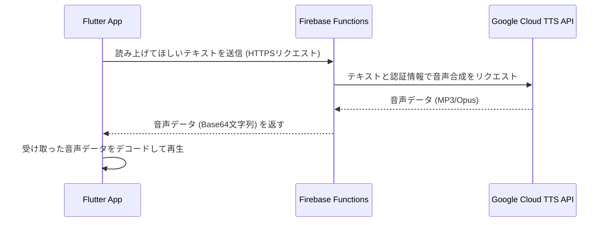

# Google Cloud TTS 切り替え手順書

本ドキュメントは、Flutterアプリの音声再生機能を、既存の `flutter_tts` (デバイス標準TTS) から Google Cloud Text-to-Speech (高品質クラウドTTS) に安全に切り替えるための手順を記したものです。

## 0. 推奨アーキテクチャについて

**警告:** Google CloudのAPIキーやサービスアカウントキー（秘密鍵）を、Flutterのようなクライアントサイドのアプリに直接埋め込むことは絶対に避けてください。キーが第三者に抜き取られ、不正利用されると高額な請求が発生する可能性があります。

このリスクを回避するため、クライアントアプリとGoogle Cloud APIの間に **Firebase Functions** を中継サーバーとして配置するアーキテクチャを採用します。



---

## ステップ1: Google Cloud TTS APIの有効化とサービスアカウント作成

1.  **Google Cloudコンソールにログイン**
    - [Google Cloudコンソール](https://console.cloud.google.com/) を開き、ご自身のプロジェクトを選択します。

2.  **Text-to-Speech APIを有効化**
    - 左上のナビゲーションメニューから「APIとサービス」>「ライブラリ」を選択します。
    - 検索バーに `Cloud Text-to-Speech API` と入力し、表示されたAPIをクリックして「有効にする」ボタンを押します。

3.  **サービスアカウントの作成**
    - 「APIとサービス」>「認証情報」に移動します。
    - 「+ 認証情報を作成」をクリックし、「サービスアカウント」を選択します。
    - **サービスアカウント名**を入力します（例: `tts-function-caller`）。
    - 「作成して続行」をクリックします。

4.  **ロール（権限）の付与**
    - 「ロールを選択」で `Cloud AI サービス ユーザー` というロールを検索し、選択します。これにより、AI関連のAPI（TTSを含む）を呼び出す権限が付与されます。
    - 「続行」をクリックし、「完了」を押してサービスアカウントの作成を終えます。

5.  **サービスアカウントキー（秘密鍵）の作成**
    - 作成したサービスアカウントのメールアドレスをクリックします。
    - 「キー」タブに移動し、「鍵を追加」>「新しい鍵を作成」を選択します。
    - キーのタイプとして **JSON** を選択し、「作成」をクリックします。
    - **重要:** `xxxx.json` というファイルがダウンロードされます。これがFirebase FunctionsからGoogle Cloudを安全に利用するための「秘密鍵」です。**このファイルは絶対に他人に渡したり、Gitで公開したりしないでください。**

---

## ステップ2: Firebase Functionsのセットアップ

1.  **Firebase CLIのインストール（未導入の場合）**
    ```bash
    npm install -g firebase-tools
    ```

2.  **Firebaseへのログイン**
    ```bash
    firebase login
    ```

3.  **Functionsの初期化**
    - プロジェクトのルートディレクトリ（`pubspec.yaml` がある場所）で、以下のコマンドを実行します。
    ```bash
    firebase init functions
    ```
    - 対話形式で質問されます。以下のように選択するのがおすすめです。
      - `Use an existing project` を選択し、ご自身のFirebaseプロジェクトを選びます。
      - `What language would you like to use...?` → `TypeScript`
      - `Do you want to use ESLint...?` → `Yes`
      - `Do you want to install dependencies with npm now?` → `Yes`
    - `functions` というディレクトリが作成されます。

---

## ステップ3: Firebase Functionsに関数を実装する

1.  **サービスアカウントキーの配置**
    - ステップ1でダウンロードした **JSONキーファイル** を、作成された `functions` ディレクトリ直下に移動します。

2.  **.gitignoreの更新**
    - `functions/.gitignore` ファイルを開き、最終行にダウンロードしたJSONファイル名を追加して、Gitにコミットされないようにします。
    ```
    # ... 既存の内容 ...
    # サービスアカウントキーを追加
    your-service-account-file-name.json
    ```

3.  **必要なライブラリの追加**
    - `functions` ディレクトリに移動し、以下のコマンドを実行します。
    ```bash
    cd functions
    npm install @google-cloud/text-to-speech
    cd ..
    ```

4.  **関数のコードを記述**
    - `functions/src/index.ts` を開き、内容を以下のように書き換えます。
      - **注意:** `serviceAccountKey.json` の部分は、ご自身のJSONファイル名に置き換えてください。

    ```typescript
    import * as functions from "firebase-functions";
    import * as admin from "firebase-admin";
    import {TextToSpeechClient} from "@google-cloud/text-to-speech";

    // Firebase Admin SDKの初期化
    // JSONキーファイル名を自身のものに置き換えてください
    const serviceAccount = require("../serviceAccountKey.json");
    admin.initializeApp({
      credential: admin.credential.cert(serviceAccount),
    });

    // Google Text-to-Speechクライアントの初期化
    const ttsClient = new TextToSpeechClient();

    /**
     * テキストを受け取り、音声をBase64エンコードされた文字列として返す
     * HTTP Callable Function
     */
    export const synthesizeSpeech = functions
      .region("asia-northeast1") // 東京リージョン（任意で変更可）
      .https.onCall(async (data, context) => {
        // 認証済みユーザーからの呼び出しかチェック（任意）
        // if (!context.auth) {
        //   throw new functions.https.HttpsError(
        //     "unauthenticated",
        //     "The function must be called while authenticated."
        //   );
        // }

        const text = data.text;
        if (!text || typeof text !== "string") {
          throw new functions.https.HttpsError(
            "invalid-argument",
            "The function must be called with one argument 'text' containing the message to synthesize."
          );
        }

        try {
          const request = {
            input: {text: text},
            // 高品質なWaveNet音声を選択
            voice: {languageCode: "en-US", name: "en-US-Wavenet-D"},
            audioConfig: {audioEncoding: "MP3" as const},
          };

          const [response] = await ttsClient.synthesizeSpeech(request);
          const audioContent = response.audioContent;

          if (audioContent instanceof Uint8Array) {
            return {audioContent: audioContent.toString("base64")};
          }
          return {audioContent: audioContent};

        } catch (error) {
          console.error("TTS Error:", error);
          throw new functions.https.HttpsError(
            "internal",
            "Failed to synthesize speech.",
            error
          );
        }
      });
    ```

---

## ステップ4: Flutterアプリの改修

1.  **依存関係の変更**
    - `pubspec.yaml` を開き、`dependencies` セクションを以下のように変更します。
      - `flutter_tts` を削除
      - `cloud_functions` と `just_audio` を追加
    ```yaml
    dependencies:
      flutter:
        sdk: flutter
      # ... 他の依存関係 ...

      # flutter_tts: ^x.x.x  <-- この行を削除またはコメントアウト

      cloud_functions: ^4.6.0 # 最新版を確認してください
      just_audio: ^0.9.36     # 最新版を確認してください
      # just_audio_web: ^0.4.8 # Webで使う場合はこちらも
    ```
    - ターミナルで `flutter pub get` を実行します。

2.  **TtsServiceの書き換え**
    - `lib/services/tts_service.dart` を以下のように書き換えます。
    - この例では音声再生に `just_audio` を使っています。

    ```dart
    import 'dart:convert';
    import 'dart:typed_data';
    import 'package:cloud_functions/cloud_functions.dart';
    import 'package:just_audio/just_audio.dart';

    class TtsService {
      static final TtsService _instance = TtsService._internal();
      factory TtsService() => _instance;
      TtsService._internal();

      final FirebaseFunctions _functions = FirebaseFunctions.instanceFor(region: 'asia-northeast1');
      final AudioPlayer _audioPlayer = AudioPlayer();
      bool _isSpeaking = false;

      bool get isSpeaking => _isSpeaking;

      Future<void> speakEnglish(String text) async {
        if (text.isEmpty) return;

        _isSpeaking = true;
        try {
          // Firebase Functionsの 'synthesizeSpeech' 関数を呼び出す
          final HttpsCallable callable = _functions.httpsCallable('synthesizeSpeech');
          final result = await callable.call<Map<String, dynamic>>({'text': text});

          final String audioBase64 = result.data['audioContent'];
          final Uint8List audioBytes = base64Decode(audioBase64);

          // just_audioで再生
          final source = _MyCustomSource(audioBytes);
          await _audioPlayer.setAudioSource(source);
          await _audioPlayer.play();

          // 再生完了を待つ
          await _audioPlayer.processingStateStream
              .firstWhere((state) => state == ProcessingState.completed);

        } on FirebaseFunctionsException catch (e) {
          print('Functions Error: ${e.code} - ${e.message}');
        } catch (e) {
          print('TTS Service Error: $e');
        } finally {
          _isSpeaking = false;
          await stop();
        }
      }

      Future<void> stop() async {
        await _audioPlayer.stop();
        _isSpeaking = false;
      }

      void dispose() {
        _audioPlayer.dispose();
      }
    }

    // just_audioでメモリ上のバイトデータを再生するためのカスタムAudioSource
    class _MyCustomSource extends StreamAudioSource {
      final Uint8List bytes;
      _MyCustomSource(this.bytes);

      @override
      Future<StreamAudioResponse> request([int? start, int? end]) async {
        start ??= 0;
        end ??= bytes.length;
        return StreamAudioResponse(
          sourceLength: bytes.length,
          contentLength: end - start,
          offset: start,
          stream: Stream.value(bytes.sublist(start, end)),
          contentType: 'audio/mpeg', // MP3の場合
        );
      }
    }
    ```
    - **注意:** 上記は `TtsService` の基本的な書き換え例です。既存のアプリのロジック（再生速度の制御など）に合わせて調整が必要です。Google TTSでは音声合成時に速度を指定できますが、今回は固定にしています。

---

## ステップ5: デプロイ

1.  **Firebase Functionsのデプロイ**
    - ターミナルで以下のコマンドを実行します。
    ```bash
    firebase deploy --only functions
    ```

2.  **Flutter Webアプリのデプロイ**
    - これまで通りの手順でWebアプリをビルドし、デプロイします。
    ```bash
    flutter build web
    firebase deploy --only hosting
    ```

---

## ステップ6: 予算アラートの設定（推奨）

意図しない課金を防ぐため、Google Cloudコンソールで予算アラートを設定しておくことを強く推奨します。

1.  Google Cloudコンソールのナビゲーションメニューから「請求」を選択。
2.  左側のメニューから「予算とアラート」を選択。
3.  「予算を作成」をクリック。
4.  名前を付け、対象のプロジェクトが選択されていることを確認します。
5.  予算額を「100円」など低い金額に設定します。
6.  アクションとして、予算額の「100%」に達したら「メールアラートをすべての請求管理者とユーザーに送信する」にチェックを入れます。
7.  「完了」を押して設定を保存します。

これで、無料枠を超えて課金が発生した際にすぐにメールで通知が届くようになります。
