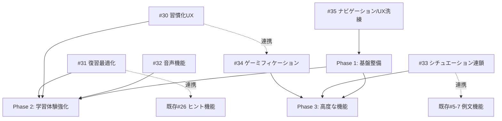

# Engrowthアプリ 実装ロードマップ

## 概要

Engrowthアプリの全機能実装を完了させるための全体計画です。  
実装順序と依存関係を考慮し、3段階のPhaseに分けて進めます。

## 全体方針

1. **基盤整備を最優先**: 他の機能の基盤となる機能から実装
2. **学習体験を強化**: 継続率と学習効率を高める機能を優先
3. **差別化機能の実装**: Engrowth独自の価値を提供する機能を追加

## Phase 1: 基盤整備（優先度：最高）

### Issue #35: ナビゲーション/UX洗練（Material Design 3/状態保持）

**期間**: 1週間

**理由**: 
- 他の機能の基盤となる
- 状態保持によりUXが大幅に向上
- Material Design 3への統一でブランディング強化

**実装内容**:
- `go_router`の`StatefulShellRoute`採用
- `BottomNavigationBar`から`NavigationBar`への置き換え
- 各タブの状態保持（スクロール位置、フィルタ状態）
- 初期画面を`/study`へリダイレクト

**依存関係**: なし（基盤機能）

**成果物**:
- タブ切替時に状態が保持される
- Material Design 3準拠のナビゲーション
- アプリ起動後すぐ学習開始可能

---

## Phase 2: 学習体験強化（優先度：高）

### Issue #32: 音声機能（再生/録音/発話入力）

**期間**: 2-3週間

**理由**: 
- 独立して実装可能
- シチュエーション学習の実践性を高める
- 「聞く・話す」を強化し、他アプリとの差別化

**実装内容**:
- `flutter_tts`パッケージ導入（TTS）
- `record`または`flutter_sound`パッケージ導入（録音）
- `speech_to_text`パッケージ導入（音声認識、任意）
- iOS/Androidのマイク権限設定
- 学習画面に音声操作ボタン追加

**依存関係**: なし（独立実装可能）

**成果物**:
- 英語/日本語/ゆっくり再生が1タップで可能
- 録音して自分の声を再生比較できる
- 音声UIが画像の視認性を損なわない

---

### Issue #30: 習慣化UX（ストリーク/今日のミッション/通知）

**期間**: 2週間

**理由**: 
- 継続率向上に直結
- 進捗管理機能（既存#20-25）と連携
- 学習習慣の定着を促進

**実装内容**:
- `user_stats`テーブル追加
- ストリーク算出ロジック（日付跨ぎ判定）
- `flutter_local_notifications`パッケージ導入
- 通知設定の永続化
- 進捗画面にストリーク表示
- 学習タブに「今日のミッション」カード追加

**依存関係**: 
- 進捗管理機能（既存#20-25）と連携推奨

**成果物**:
- 連続学習日数が正しく更新される
- 1タップで「今日のミッション」開始ができる
- 通知のON/OFFが設定画面で切り替えられる

---

### Issue #31: 復習最適化（忘却曲線/ヒント使用率）

**期間**: 2週間

**理由**: 
- 既存のヒント機能（#26）と連携
- 学習効率を最大化
- ヒント使用率を活用した復習優先度付け

**実装内容**:
- `user_progress`テーブル拡張（復習用フィールド）
- 復習優先度ロジック（ヒント使用率を加味）
- 復習間隔の算出（簡易SR: Spaced Repetition）
- 復習キュー生成ロジック
- 学習タブに「今日の復習」カード追加
- 進捗画面に「要復習」セクション追加

**依存関係**: 
- 既存のヒント機能（#26）が必要
- ヒント使用統計（#28）と連携推奨

**成果物**:
- `next_review_at`が過去のものを正しく抽出できる
- ヒント使用率が復習優先度に反映される
- 復習セッションが通常学習と同じUIで開始できる

---

## Phase 3: 高度な機能（優先度：中）

### Issue #33: シチュエーション連鎖学習（ストーリー型）

**期間**: 3週間

**理由**: 
- 例文機能（既存#5-7）の拡張
- Engrowthの差別化機能
- 「シチュエーションからの英語想起」を強化

**実装内容**:
- `scenarios`, `scenario_steps`, `user_scenario_progress`テーブル追加
- `Scenario`, `ScenarioStep`, `UserScenarioProgress`モデル実装
- シナリオ一覧画面の実装
- 学習導線（シナリオ選択 → 学習モードへ遷移）
- 完了判定と達成演出

**依存関係**: 
- 例文機能（既存#5-7）が必要
- 学習モード（既存#26）が必要

**成果物**:
- シナリオ選択から順番に学習できる
- 進捗が中断/再開で維持される
- 完了時に視覚的な達成演出がある

---

### Issue #34: ゲーミフィケーション（バッジ/称号/演出）

**期間**: 2週間

**理由**: 
- 習慣化UX（#30）と連携
- モチベーション向上
- 達成感と継続意欲を高める

**実装内容**:
- `achievements`, `user_achievements`テーブル追加
- `Achievement`, `UserAchievement`モデル実装
- 解除判定ロジック（ストリーク、例文数、シナリオ完了、ヒントなし正解など）
- 達成演出のアニメーション実装
- 進捗画面に「称号/バッジ」セクション追加

**依存関係**: 
- 習慣化UX（#30）と連携
- シチュエーション連鎖学習（#33）と連携推奨

**成果物**:
- 条件達成時にバッジが解除される
- 解除演出が表示され、学習を妨げない
- 進捗画面でバッジ一覧が確認できる

---

## 実装順序の全体像

```
Phase 1: 基盤整備（1週間）
  └─ #35 (ナビゲーション/UX洗練)

Phase 2: 学習体験強化（6-7週間）
  ├─ #32 (音声機能) [独立、2-3週間]
  ├─ #30 (習慣化UX) [2週間]
  └─ #31 (復習最適化) [2週間]

Phase 3: 高度な機能（5週間）
  ├─ #33 (シチュエーション連鎖) [3週間]
  └─ #34 (ゲーミフィケーション) [2週間]
```

**合計期間**: 約12-13週間（約3ヶ月）

## 依存関係図



## 各Phaseの成果物

### Phase 1完了時
- タブ切替時に状態が保持される
- Material Design 3準拠のナビゲーション
- アプリ起動後すぐ学習開始可能

### Phase 2完了時
- 音声機能で「聞く・話す」が強化される
- ストリークと今日のミッションで継続率が向上
- 復習最適化で学習効率が最大化される

### Phase 3完了時
- シチュエーション連鎖学習で差別化機能が完成
- ゲーミフィケーションでモチベーションが向上
- Engrowth独自の価値が確立される

## リスク管理

### 技術的リスク
- **音声機能の実装難易度**: 端末依存のため、テスト環境の確保が重要
- **状態保持の実装**: `StatefulShellRoute`の理解が必要

### スケジュールリスク
- **Phase 2の並行実装**: #32は独立実装可能なため、#30と並行して進めることを推奨
- **Phase 3の依存関係**: #33と#34は依存関係が少ないため、並行実装を検討

## 次のステップ

1. **Phase 1の実装開始**: Issue #35から着手
2. **並行作業の検討**: Phase 2では#32と#30を並行実装
3. **ユーザーテスト**: 各Phase完了時にユーザーフィードバックを収集
4. **継続的な改善**: 実装中に発見された課題を反映

## 関連ドキュメント

- `docs/ALL_ISSUES_LIST.md`: 全Issue一覧
- `docs/INITIAL_ISSUES_DETAILED.md`: Issue詳細リスト
- `docs/HABIT_UX_IMPLEMENTATION.md`: 習慣化UX導入手順
- `docs/REVIEW_OPTIMIZATION_IMPLEMENTATION.md`: 復習最適化導入手順
- `docs/AUDIO_SPEAKING_IMPLEMENTATION.md`: 音声機能導入手順
- `docs/SCENARIO_CHAIN_IMPLEMENTATION.md`: シチュエーション連鎖学習導入手順
- `docs/GAMIFICATION_IMPLEMENTATION.md`: ゲーミフィケーション導入手順
- `docs/NAVIGATION_UI_POLISH_IMPLEMENTATION.md`: ナビゲーション/UX洗練導入手順
