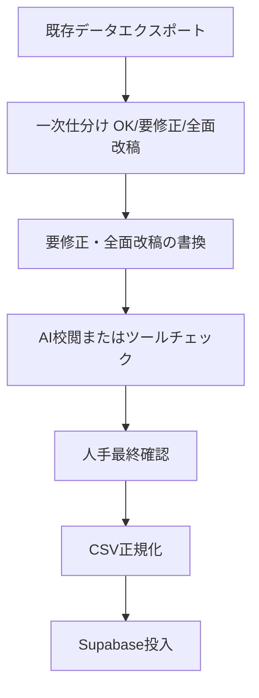

# 英会話修正・書換ワークフロー

既存会話を自然な米国日常会話品質へ改訂するための手順です。

---

## 1. 全体フロー



---

## 2. Step A: 既存会話の一次仕分け

### 入力
- `conversation_utterances` エクスポートCSV
- `conversation_quality_rubric.md` のルーブリック
- `conversation_review_checklist.md` のチェックリスト

### 手順
1. 発話（`english_text`）を1件ずつ確認
2. 次のパターンに該当する場合は **要修正** または **全面改稿** とする
   - `conversation_review_checklist.md` の「自動検出パターン」に該当
   - ルーブリックの「典型的な問題パターン」に該当
3. 同一会話内の発話が混在する場合は、会話単位で **最も厳しい判定** を採用
   - 例: 1発話が全面改稿 → 会話全体を全面改稿

### 出力
- `audit_result.csv`: conversation_id, utterance_id, classification (OK/REVISE/REWRITE), notes

---

## 3. Step B: 要修正・全面改稿の書換

### 原則
1. **意図を保持**: 日本語訳・シーン設定を変えない
2. **自然な英語優先**: 目標語彙を「詰め込まない」。語彙は書換後に結果的に抽出
3. **チャンク活用**: "I'd like to ~", "Could you ~", "Let me ~" 等の頻出パターンを利用

### AI活用時のプロンプト例
```
次の英文は不自然です。日本語の意図を保持したまま、米国日常で自然に使われる英語に書き換えてください。
- 1発話1文〜2文を基本とする
- 語彙は NGSL 1-1000 を優先（初級）または NGSL 1-3000（中級）
- 語を無理に詰め込まない

英語（修正前）: [原文]
日本語: [訳]
シーン: [例: 銀行口座開設]
```

### 書換後の検証
- 語彙チェック: NGSLリストとの照合（オプション）
- 長さチェック: 1発話20語以内を推奨（長文は分割可）

---

## 4. Step C: 各シーンのパターン数確保

| レベル | シーンあたり目標 | 備考 |
|--------|------------------|------|
| 初級（1000語） | 5〜10パターン | 不足分は新規作成 |
| 中級（3000語） | 15〜30パターン | 段階的に拡充 |

同一シーン内で、シチュエーションのバリエーション（例: カフェ「注文」「クレーム」「会計」）を増やす。

---

## 5. Step D: 3分連続と短区間のタグ付け

- **3分連続**: 1会話が約3分で再生可能な長さ（目安: 15〜25発話）
- **短区間**: 15〜45秒で区切った練習用セグメント（発話範囲を `start_order`, `end_order` で管理する場合は、メタデータまたは別テーブルで管理）

現行スキーマに `duration_seconds` や `segment_ranges` がない場合は、`conversations` の `description` やカスタムフィールドで運用し、将来的にスキーマ拡張を検討。

---

## 6. Step E: 監修チェック

1. **AI校閲**: 書換後の英文を再度「自然さ」で評価するプロンプトを実行
2. **人手最終確認**: 少なくとも各シーン1会話はネイティブまたは高精度校閲者が確認

---

## 7. 成果物

- 修正済み `conversation_utterances` 相当のCSV（Scenario_ID, Order, Role, Text_EN, Text_JP）
- `audit_result.csv`（仕分け結果）
- 修正履歴（差分ログ、任意）
