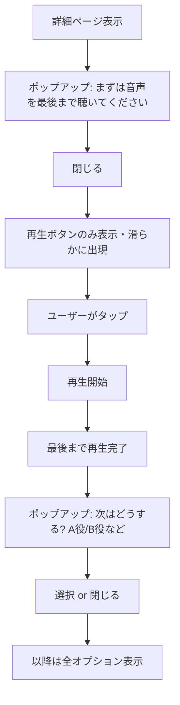

# Speak風 順序立てガイドフロー 実装PLAN

## Goal

- 30秒シナリオ・3分英会話・パターンスプリントの詳細ページを、Speakのように**流れに沿って順序だてて**ボタン表示・ポップアップで促すUXに統一する。
- グレーアウト表示を廃止し、**ポップアップ → 再生ボタン出現 → 聴き終わり → 次アクション促し**の段階的フローに置き換える。
- 表示情報を減らしつつ、必要な情報は都度**高級感のある演出と最適なスピード**（Motion Token準拠）で提示する。

## Non-goal

- 既存の「必ず一度は最初から最後まで聴く」ルールの変更（ルールは維持、表現方法のみ変更）。
- パターンスプリントの3段階練習ロジックの変更。
- 全コンテンツへの一括適用（今回は3種に限定）。

## Exit Criteria

- 初回アクセス時、グレーアウトボタン・黄色案内ボックスを廃止し、代わりにポップアップで「まずは音声を最後まで聴いてください」を表示。
- ポップアップ閉じ後、再生ボタンのみを滑らかに出現させ、タップを促す。
- 聴き終わり後、次のアクション（A役で練習など）を促すポップアップを表示。
- 2回目以降アクセス時は、再生ボタン、A役で練習、B役で練習、を滑らかに出現させる。
- 30秒シナリオ・3分英会話・パターンスプリントの3種で一貫したフローを実現。
- Motion Token（EngrowthElementTokens / EngrowthStaggerTokens）準拠、Zero-Latency維持。

---

## 共通フロー設計

### 初回 vs 2回目以降の判定

| コンテンツ種別 | 初回判定キー | 保存場所 |
|----------------|-------------|----------|
| 30秒シナリオ | `conversationId` | SharedPreferences / Provider |
| 3分英会話 | `storyId` | 同上 |
| パターンスプリント | `prefix`（カテゴリ単位） | 同上 |

- 初回: 聴き終わり完了が未記録 → ガイドフロー適用
- 2回目以降: 聴き終わり完了済み → 従来表示（全オプション表示）

### 共通ステップ（初回時）

---

## 30秒シナリオ（ConversationStudyScreen）最適化

### 現状

- 会話全体を聴くボタン、黄色案内「まず会話全体を聞くで…」、グレーアウトA役/B役、この発話を再生、前へ/次へ、録音等が一括表示。
- 聴き終わり後に「次はどうする?」モーダル表示（既存）。

### 変更方針

1. **初回時（_hasListenedToAll == false かつ 初回フラグ）**
   - 表示: イラスト＋役バッジ＋**ポップアップのみ**（「まずは音声を最後まで聴いてください」）
   - 再生ボタン・A役/B役・この発話を再生・前へ/次へは**非表示**
   - ポップアップ閉じ後: **再生ボタン（会話全体を聴く）のみ**を StaggerReveal で出現
   - 聴き終わり後: 既存の「次はどうする?」モーダル表示 → 初回完了フラグを記録
   - 以降: 従来どおり全UI表示

2. **情報密度の削減**
   - 初回時は「この発話を再生」「前へ/次へ」を隠す（会話全体を聴いた後に表示）。
   - 聴き終わり後のモーダルは既存のまま（AIと会話、もう一度、A役、B役）。

### 影響ファイル

- `lib/screens/conversation_study_screen.dart`
- `lib/providers/` または `lib/services/` に初回完了フラグ永続化
- 新規: `lib/widgets/guided_flow/listen_first_popup.dart`（共通化候補）

---

## 3分英会話（StoryStudyScreen）最適化

### 現状

- 「3分一気に聴く」「役で3分通し練習」「チャンクで聴く・練習する」が一括表示。
- 聴き終わりルールは未実装（現状は全オプション即時利用可能）。

### 変更方針

1. **初回時**
   - 表示: ヒーローバナー＋**ポップアップ**「まずは音声を最後まで聴いてください」
   - 「再生して聴く」以外（A役/B役、チャンク一覧）は**非表示**
   - ポップアップ閉じ後: 「再生して聴く」ボタンのみ FadeSlideSwitcher で出現
   - 聴き終わり後: ポップアップ「次はどうする?」で A役/B役/チャンク を案内
   - 初回完了フラグ記録後: 全セクション表示

2. **情報密度の削減**
   - 初回時は「役で3分通し練習」「チャンクで聴く・練習する」を折りたたみ or 非表示。
   - 聴き終わり後に StaggerReveal で順次表示。

### 影響ファイル

- `lib/screens/story_study_screen.dart`
- 初回完了フラグ永続化（storyId 単位）

---

## パターンスプリント（PatternSprintListScreen + SessionScreen）最適化

### 現状

- **一覧**: セッション長選択、カテゴリ別「〇〇でスタート」ボタン、個別パターンの再生ボタンが一括表示。
- **セッション**: 3段階練習（日英→英文のみ→テキストなし）はそのまま。

### 変更方針

1. **一覧（PatternSprintListScreen）**
   - 初回カテゴリアクセス時: ポップアップ「まずは音声を聴いてから、まねして言いましょう」
   - 閉じ後: 選択中カテゴリの「〇〇でスタート」ボタンのみ強調表示（他カテゴリは控えめ or 折りたたみ）
   - 2回目以降: 従来どおり全カテゴリ表示

2. **セッション（PatternSprintSessionScreen）**
   - 初回プレフィックス時: 開始前に軽いポップアップ「聞く→まねして言う を繰り返します」（既存 LearningIntroDialog と統合可能）
   - セッション中の3段階フローは変更なし（既に順序立て済み）。

3. **情報密度の削減**
   - 一覧で未選択カテゴリを初期は折りたたみ、選択カテゴリのみ展開。
   - 「〇〇でスタート」を主CTAとし、個別パターン一覧は展開後に表示。

### 影響ファイル

- `lib/screens/pattern_sprint_list_screen.dart`
- `lib/screens/pattern_sprint_session_screen.dart`（必要に応じて開始前ポップアップ調整）
- `lib/widgets/tutorial/learning_intro_dialog.dart`（再利用 or 拡張）

---

## 共通コンポーネント設計

### ListenFirstPopup（新規）

- 文言: 「まずは音声を最後まで聴いてください」
- スタイル: engrowth_theme 準拠、角丸・影・フェードイン（EngrowthElementTokens）
- 閉じ方: タップで閉じる（LearningIntroDialog と同様）
- 閉じ後コールバック: 再生ボタン出現のトリガー

### NextActionPopup（既存拡張）

- 既存「次はどうする?」モーダルをベースに、Motion Token でアニメーション統一。
- 出現: FadeSlideSwitcher 相当のトランジション（180ms）

### 初回完了フラグ永続化

- Provider + SharedPreferences で `first_listen_completed_{contentType}_{id}` を保存。
- 例: `first_listen_completed_conversation_abc123` = true

---

## Motion Token 準拠

- 緩やかで高級感のある同期（5倍速）: ページ移動・ボタン登場が揃うことで遅く感じない
- ポップアップ出現: `EngrowthElementTokens.switchDuration`（900ms）
- ボタン段階表示: `EngrowthStaggerTokens`（250ms delay, 900ms duration）
- ページ遷移: `EngrowthRouteTokens`（standardPush 1100ms, modalPush 900ms）

---

## 影響ファイル一覧

| ファイル | 役割 |
|----------|------|
| `lib/screens/conversation_study_screen.dart` | 30秒シナリオ ガイドフロー |
| `lib/screens/story_study_screen.dart` | 3分英会話 ガイドフロー |
| `lib/screens/pattern_sprint_list_screen.dart` | パターンスプリント一覧 ガイドフロー |
| `lib/screens/pattern_sprint_session_screen.dart` | セッション開始前ポップアップ（必要時） |
| `lib/widgets/guided_flow/listen_first_popup.dart` | 共通「まずは音声を…」ポップアップ（新規） |
| `lib/providers/first_listen_completed_provider.dart` | 初回聴き終わりフラグ（新規） |
| `lib/widgets/tutorial/learning_intro_dialog.dart` | 必要に応じて拡張 |
| `lib/theme/engrowth_theme.dart` | 既存 Motion Token 参照 |

---

## PR分割（1PR=1目的）

| PR | 目的 | 対象 |
|----|------|------|
| **PR1** | 初回聴き終わりフラグ永続化 | Provider + SharedPreferences |
| **PR2** | ListenFirstPopup 共通コンポーネント | 新規 Widget |
| **PR3** | 30秒シナリオ ガイドフロー | ConversationStudyScreen |
| **PR4** | 3分英会話 ガイドフロー | StoryStudyScreen |
| **PR5** | パターンスプリント ガイドフロー | PatternSprintListScreen |

---

## 計測イベント

| イベント | 発火タイミング | event_properties |
|----------|----------------|------------------|
| `guided_flow_popup_shown` | ポップアップ表示時 | `content_type`, `step` (listen_first / next_action) |
| `guided_flow_popup_dismissed` | 閉じた時 | `content_type`, `step`, `reason` (tap / auto) |
| `guided_flow_play_revealed` | 再生ボタン出現時 | `content_type` |
| `guided_flow_first_listen_completed` | 初回聴き終わり時 | `content_type`, `content_id` |

---

## 制約・Guardrails

- **Sound-First / Zero-Latency**: 再生開始を遅らせない。ポップアップは短く、閉じたら即再生可能に。
- **engrowth_theme.dart 準拠**: 色・余白・アニメーションはトークン経由。
- **1PR=1目的**: 上記PR分割を厳守。
